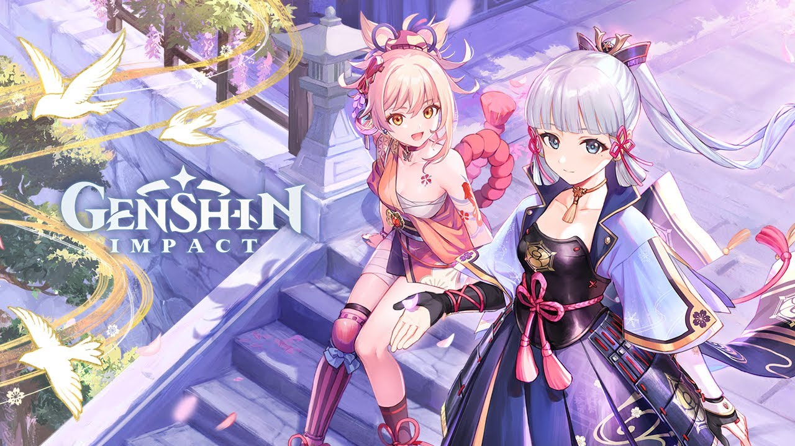

## How to create your own Bot with Artificial Intelligence that plays your favorites  RPG or MMORPG games

Today I will try to explain how to create a program that will play your favorite **video games**. This is useful when you don't have time to farm and you need to kill moobs and get items. 

If you are interested in joining to this project, you are **welcome** to contribute.

You can join to [slack here](https://join.slack.com/share/enQtMjg3MzM0OTY2MDMzNy04NDY5OGE2NzJiNTk4YzkyYjBlMDAyMzBiNzlkZTIyNzllOTA5MmQ5NDkzOTEyYmQ0MTgxZjAyNjM0MWM2NThl)

The **RPG** game that I will choose for this project are

 [Genshin Impact](https://genshin.mihoyo.com/en/):

but also this program should be compatible with  **New World** , **World of Warcraft**, ****, **Guild Wars 2** ,**Final Fantasy XIV**, Elder **Scrolls Online** and so on.

Currently due to lack of time, just I will develop this interesting project on **Genshin Impact**, that can be used as a template to use to the remaining games.

The objective of the project is develop a 

**a) general neural network** that can be adapted to different videogames that can be useful to  automatize video games.

and 

**b)** **develop the local/cloud infrastructure** that allows us record and process the data.

The cloud technologies that can be used in principle can be from AWS, Google Cloud and  Microsoft Azure. We can try to test each of them.

We will start with the local and some free AWS microservices.

c) **Enjoy coding and pass fun**, one of the important aspects of this project is to learn, enjoy and pass good moments with the **AI Community Gamer**.

## Current Solution

The preliminary solution is given with the following parts:

1. **[Creation of the frontend application](./frontend/README.md)** - Here, we need to create the python program that will record our gameplay and control our videogame. This program should be able to record the screen during the gameplay.  (**updated dec 2021**)      
2. **Creation of the backend pipeline-** Here, we need to create a pipeline program that will move the recorded data into the cloud. Here we can use object storage like **s3** or **minio**. This allows us do not to saturate the **hard disk** on the client side during the **gameplay.** 
3. **Creation of the Dataset** - In this part, we have to create a dataset of the gameplay, recording the keys and mouse position and the screen. The recorded dataset may be stored in a non-relational database.
4. Data wrangling** -This part, we have to augment the images correctly to create the appropriate machine learning model. Here we need to apply good skills in computer vision.
5. **Model creation**- The first version of this bot will use Neural Networks. The framework used will be **Tensorflow** and **Pytorch**. Here we will create the brain of our bot.
6. **Training g Docker Container** -Creation o the Docker container environment with **JypyterLab** for this Bot project with all the training packages.
7. **Training of the model** - Here, we need to train the neural network. Here we may require a cluster. We can use the **Colab** to use the training with colab or pay a little to run a cluster on **EMR AWS** with a Container with all our environment ready.
8. **Creation of the frontend application that plays** - Here, we need to create a program that reads the game's screen and depends on what executes the Artificial intelligence Model you have made before.

## Contributing

Please free  to contribute following the standard guidelines for submitting patches and additions or solutions. Feel free to submit issues and enhancement requests.

To more information visit [ruslanmv.com](https://ruslanmv.com/).

