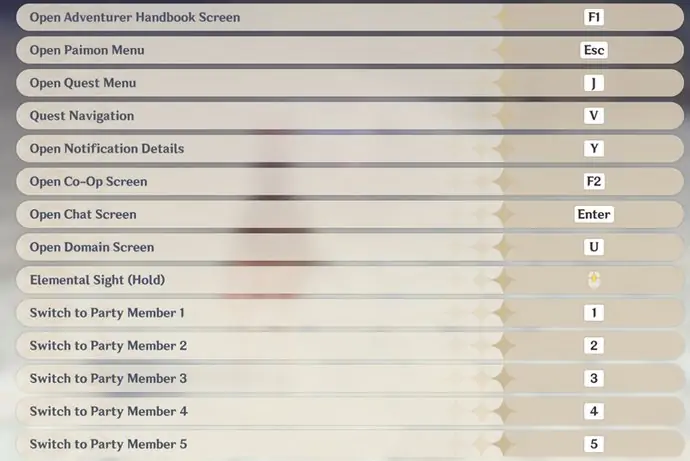

## Frontend - Gameplay  Record

Here we are going to create a program that will record the the keyboard and mouse and screen during your gameplay.

The **frontend layer** of this project is one of **hardest** part due to the **anticheat security system** of the games.  So the methodology chosen should be the most simple possible and undetectable, I know is not quite easy to afford that but in general always there are ways to achieve that.


## Frontend Design 

The frontend part consists basically intro three layers.


**Layer 0** is the layer where the player start playing the videogame.

**Layer 1**. In this part we  generate the data by  recording the **keyboard** + **mouse** during the **gameplay** in PC. The current project does not support mobile games at the moment. 

**Layer 2**. We should incorporate a mechanims that ingest the temporal data into a  datalake.

We wont use any commercial program to solve this problem. We want to use a **free** , **open source** program that anyone can **read** ,**modify** and **improve**.

## Environment setup


We will use a python language as a base to develop the **first layer** of the generation of the data.

The **second layer** should be the ingestion to the **datalake**.


For the local enviroment we  need to install anaconda at this [link](https://www.anaconda.com/products/individual)


then in the command prompt terminal we type

```
conda create -n game   python==3.7 findspark tensorflow pytorch jupyterlab
```

I will use **Tensorflow** + **Pytorch** + **Spark** as the  main frameworks for future work, and this time I will use JupyterLab 

```
conda game activate
```

then in your terminal type the following commands:

```
conda install ipykernel
python -m ipykernel install --user --name game --display-name "Python (game)"
```

Installing libraries needed for the frontend

```
pip install pynput numpy pyautogui opencv-python
```

then open the jupyterlab with the command

```
jupyter lab
```

## Requirements of the images gameplay (v.01)

The pictures of the gameplay should satisfy the following requirements:

Dimensions: **320x160**, 

Width: **320 pixels**

Height **160 pixels**

Horizontal resolution:**96dpi**

Vertical resolution: **96 dpi**

Bith depth: **24**

Format: **JPG**

The screenshots should be saved in the directory **IMG**, for example:

C:\IMG\gameplay_2021_10_17_12_15_37_666.jpg

C:\IMG\gameplay_2021_10_17_12_15_37_771.jpg

 C:\IMG\gameplay_2021_10_17_12_15_37_876.jpg

.

.

.

C:\IMG\right_2021_10_17_12_15_45_810.jpg

**Controls** for Genshin Impact covers information on input methods supported by the game and used to control the player character as well as navigate menus and user interfaces. 


## Controls Registration

### PC Key Bindings

We are going to use the default key bindings for the standard Keyboard + Mouse controls. 

The first  aim of this program is register only the **navigation** and  **combat**  during the gameplay. 

For optimal use of this program, the gameplay resolution should be  1920x 1080, 4k resolution currently is not supported.

## Considered controls in the registration

### Controls

- Move Forward : W
- Move Backward : S
- Move Left : A
- Move Right : D
- Normal Attack : Left Mouse Button
- Elemental Skill : E
- Sprint : Left Shift / Right Mouse Button
- Jump : Space
- Elemental Burst : Q
- Pick Up / Interact : F


## Not considered

The following controls are not considered in the current version of the registration:

- Inventory : B
- Open Character Screen : C
- Map : M
- Open Wish Screen : F3

- Open Adventurer Handbook Screen : F1

- Paimon Menu : Esc

- Open Quest Menu : J

- Navigation : V

- Open Notification Details : Y

- Co-Op Screen : F2

- Chat Screen : Enter

- Open Domain Screen : U

- Elemental Sight (Hold) : Mouse Wheel Button

- Switch to Party Member

  



- Switch Aiming Mode : R
- Switch Walk / Run : Left Ctrl
- Check Tutorial Details : G
- Open the Events Menu : F5
- Open Battle Pass Screen : F4
- Challenge Interrupted : P

### Requirements of the gaming_log.csv (v.01)

The log file  should be saved in the directory **LOG**:

Each row of the dataset should include

For example  when during the registration the character is **AFK** (away from keyboard)  the **.csv** file should have the following data:


C:\IMG\gameplay_2021_10_17_12_15_37_666.jpg, 0,0,0,0,0,0,0,0,0,0,0,0,0,0,0

C:\IMG\gameplay_2021_10_17_12_15_37_771.jpg,  0,0,0,0,0,0,0,0,0,0,0,0,0,0,0

 C:\IMG\gameplay_2021_10_17_12_15_37_876.jpg, 0,0,0,0,0,0,0,0,0,0,0,0,0,0,0

.

.

.

C:\IMG\right_2021_10_17_12_15_45_810.jpg,   0,0,0,0,0,0,0,0,0,0,0,0,0,0,0


### Keyboard Recording

The keybord recording will be given by one python script as follows:

**[Keyboard and Mouse recording](./recording/README.md)** 


