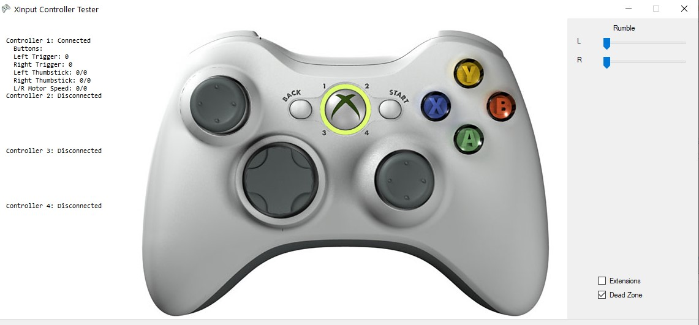

## Input  Recording
There are two methods to record the input

- **ScpVbus** - Allows record the Gamepad and Keyboard(**working**)

- **vjoy-gamepad** Allows control the  Gamepad in the Gampley(**working**)

  

##  Connect xbox controller to Windows 10

To connect any xbox  game controller to Windows 10, we follow this procedure step by step:

Click the **Search** button, type **Settings** in the search bar. 

The **Windows Settings** screen will open. Select **Devices** option as follows:


As you will select the **Devices** option, the following screen will appear:


Select **Add Bluetooth or other device** option as the above image is showing. As you will select this option, the following dialogue will appear:


Select the **Bluetooh** option as above image is showing. It will display the connected **Game Controller**, select that and click **Done** button.

To use the Virtual Controller object, you need `ScpVBus`. For ease [one of it's versions](https://github.com/shauleiz/vXboxInterface) is included in this project. More information about the original can be found at [nefarius's archived repo](https://github.com/nefarius/ScpVBus).
You'll probably also require [x360ce](https://www.x360ce.com/#Help_Old_Version) for easing the connection to games as well as debugging it. I've included it's older version as that's the one that worked for me. 


# ScpVbus

### Installing ScpVbus

We need ScpVBus to talk to Windows about gamepad related details:
Open an elevated cmd command prompt in the ScpVBus-x64 directory and run `devcon.exe install ScpVBus.inf Root\ScpVBus`. Successful run is indicated by the following message:

    Device node created. Install is complete when drivers are installed...
    Updating drivers for Root\ScpVBus from {Location}\PYXInput\ScpVBus-x64\ScpVBus.inf.
    Drivers installed successfully.

After you have installed your **Driver**, connect yuo xbox driver, you can open the program at`versions\0.01\vXboxInterface-x64\SCPUser.exe` and you will see




# vjoy-gamepad


vjoy is a module that emulates a generic controller. 
Combine this with x360ce, which takes your generic controller and makes it emulate an xbox360 controller, and voila, you have xbox 360 controller emulation. 

I've actually employed this in game and it does work, I just have yet to find a good algorithm to apply to the network output to actually improve the driving performance. 

At the very least, however, I think coming up with something for the throttle control will be wise. Haven't had much time to mess with this, but it's definitely an option now. s

The API Gamepad that executes the control gamepad

**[vjoy-gamepad](../../versions/0.01/vjoy-gamepad/README.md)** 


## AutoHotPy (optional)

**AutoHotPy** It is an optional library to record the mouse and keyboard(**not supported**)

​                         At the moment is disabled the option to record the mouse. 

An alternative way to record the mouse and keyboard is  AutoHotPy, it is a scripting tool, just like AutoHotKey, but it uses Interception library (https://github.com/oblitum/Interception).

For the version v0.1 we **do not need** the  AutoHotPy.

It is a **future feature** for the MMORPG-AI

The reason to select  AutoHotPy is due to we want to record the mouse and is not supported by ScpVbus

The keyboard and mouse recording will be given by one python script .

The great thing is that Interception uses a very low level driver to capture keyboard and mouse events, which makes it perfect for games that have problems with AutoHotKey

## Installation
AutoHotPy doesn't really need any. You just place the scripts in the same folder and they just work. However, the libraries needed for it to run are not installed by default in any operative system.

1. Verify you have Python installed

2. Install git for Windows [here](https://git-scm.com/download/win)

3. Run your terminal as administrator

4. Download the interception Driver 

   ```
   git clone https://github.com/ruslanmv/BOT-MMORPG-AI.git
   ```

   

   ```
   cd "BOT-MMORPG-AI\frontend\input_record\Interception\command line installer"
   ```

5. Install interception driver (and restart your computer): http://oblita.com/Interception.html

   ```
   install-interception.exe /install
   ```

   hint: if double clicking in the executable doesn't install the driver (you will see an error message when you start AutoHotPy), try running a command line as administrator from the windows menu (right clicking on the program and selecting "Run as administrator"), and then go to your download location from the command line and run "install-interception.exe /install"

6. Place the .dll in the same place were you downloaded AutoHotPy. We need interception.dll to work!

   In our case the .dll is already in `BOT-MMORPG-WITH-AI\frontend\input_record`


To use AutoHotPy you only have to write a script and place it in the same folder where you installed the app.


## Running the scripts

To run any of the scripts open a command line and run 

```
python macro.py
```

```
---- Hello to Macro----
Press F1 to start/stop macro
Press F2 to start macro
Press F3 to save macro
Press F4 to clear macro
Press ESC to exit
----------

waiting key
F1 - startStopMacro
F1 - startStopMacro
F2 - fireMacro
F3 - saveMacro
ESC - exitAutoHotKey
```


With F1 you will start recording your macro, and with   F1 again you will stop the macro record.

with F2 you start the macro that in in memory.

With F3  you save your macro into a python file 'recorded_macro.py'

## TO DO
Extract the relevant information from the recorded_macro.py and  save it into a dataset of keyboard and  mouse dataset.

### Known bugs:

* the script crashes after saving a macro to a file and then trying to run the macro again. Workaround: restart the application after saving a macro to a file.


